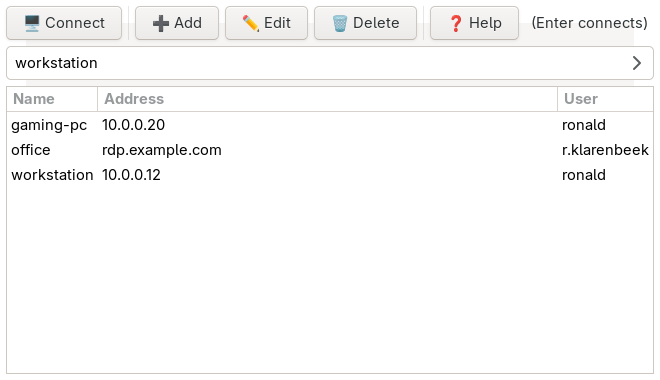

# QuickRDP

A minimal GNOME/Linux launcher for [sdl-freerdp](https://github.com/FreeRDP/FreeRDP),
FreeRDP's own client. Part of the `quick*` family (quickcast, quicksnip, quickcell):
looks devilishly simple, trusts the native GNOME theme, stays out of your way.



*(Screenshot uses invented hosts.)*

Written because the RDP client I used before ignored Enter in its connect dialog
and asked for the password every single time.

## Features

- Opens with the last host prefilled and selected. **Enter connects.**
- Adding a host only needs an address; user, password and domain are optional and the
  name defaults to the address. Enter saves.
- Saved hosts in a list; double-click connects, Edit and Delete do what they say.

- Passwords live in the **GNOME keyring** (libsecret) and are handed to sdl-freerdp over
  stdin, never on the command line. Missing one? QuickRDP asks once and stores it.
- Sensible session defaults: `/dynamic-resolution /gfx:AVC444 /network:lan +clipboard
  +auto-reconnect`. The LAN setting skips the Windows server's own network probe, which
  otherwise tends to misjudge the link and throttle the encoder into a stuttery mess.
- Session windows are filed under QuickRDP's app id, so GNOME remembers the
  "allow inhibiting shortcuts" answer instead of asking on every connect.
- Anything typed that is not a saved host is an ad hoc connect.
- `quickrdp.py <name>` connects without showing a window (handy for desktop actions).
- Sessions keep running when the launcher is closed.

## Installation

### System packages

```bash
# Fedora
sudo dnf install freerdp python3-gobject gtk3 libsecret

# Ubuntu/Debian
sudo apt install freerdp3-sdl python3-gi gir1.2-gtk-3.0 gir1.2-secret-1

# Arch
sudo pacman -S freerdp python-gobject gtk3 libsecret
```

`freerdp` must provide the `sdl-freerdp` binary (FreeRDP 3.x).

### Desktop entry (recommended)

`quickrdp.desktop` is included. Point its `Exec` lines at your clone and link it:

```bash
ln -s /path/to/quickrdp/quickrdp.desktop ~/.local/share/applications/
update-desktop-database ~/.local/share/applications/
```

The desktop file also carries a "Connect to blue" action as an example of connecting
to a saved host straight from the app grid; rename or drop it.

## Usage

```bash
python3 quickrdp.py          # the launcher
python3 quickrdp.py blue     # connect to saved host "blue" directly
```

Hosts are stored in `~/.config/quickrdp/hosts.json`, session logs in
`~/.cache/quickrdp/<name>.log`. A failed connect shows the reason as a toast.

### Controls

| Action | Input |
|--------|-------|
| Connect | Enter (in the host field), double-click a row, or "Connect" |
| Add host | Ctrl+N or "Add" |
| Edit selected host | F2 or "Edit" |
| Delete selected host | Delete (list focused) or "Delete" |
| Close launcher | Esc or Ctrl+Q (sessions keep running) |
| Release keyboard grab inside a session | Right Ctrl+G |

## Development

```bash
python3 -m unittest discover -s tests -v
python3 tools/shot.py screenshot.png     # regenerate the screenshot with invented hosts
```

## License

MIT
